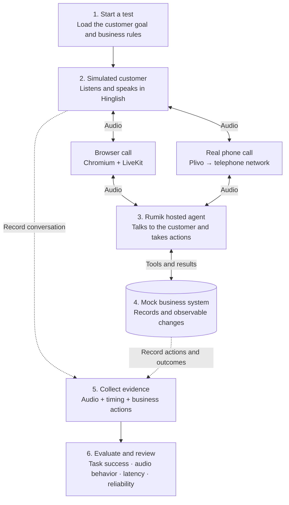

# Rumik voice-agent benchmark

Test a hosted Rumik agent through **browser audio and real telephone calls**.
Check whether it completed the permitted task using call audio, timing, tool
actions, and the resulting business state.

**Status: repository foundation, ready for implementation.** The local API,
configuration validation, shared contracts, and development tooling work. The
caller, real calls, business workflows, storage adapters, and graders are not
implemented. No agents or phone numbers have been provisioned.

## The architecture



One run uses one channel. Corresponding runs use the same target configuration
and equivalent starting conditions. Our runtime is intended for an India cloud
worker; Rumik stays on its own cloud. Vercel is optional for controls and review.

## Start locally

Install [uv](https://docs.astral.sh/uv/getting-started/installation/) and Python
3.12, then run from this repository:

```sh
uv sync --locked
uv run --locked voice-bench status
uv run --locked voice-bench plan --config configs/local.toml
uv run --locked uvicorn voice_bench.api.app:create_app --factory --reload
```

The API is at `http://127.0.0.1:8000`; API documentation is at `/docs`.

- `GET /healthz` returns 200 when the API process works.
- `GET /readyz` deliberately returns 503: live benchmark execution is unfinished.
- `status` and `plan` make no provider requests, place no calls, and create no
  run artifacts. A valid plan is not proof that integrations are ready.
- There is no `run` command or call-start route yet.

Dependency installation can access package registries. Once installed, the
status, planning, checks, and local API require no provider credentials.
Use `.venv/bin/voice-bench` to invoke the installed CLI without uv synchronization.

`configs/local.toml` holds non-secret settings. Artifact paths are relative to
the configuration file. The zero total-minute and spending budgets are explicit
no-execution defaults, not agreed benchmark limits. `.env.example` lists reserved
future settings; it is not currently loaded. Do not add real credentials yet.

## Where to implement each part

| Diagram part | Package | Responsibility |
| --- | --- | --- |
| Start a test | `src/voice_bench/controller/` | Run lifecycle, limits, correlation, retries and finalization |
| Simulated customer | `src/voice_bench/caller/` | Customer facts, audio perception, reply policy and speech |
| Browser / phone calls | `src/voice_bench/channels/` | Audio transport, connection events and hangup |
| Rumik hosted agent | `src/voice_bench/target/rumik/` | Configuration snapshots, registration and call evidence |
| Mock business system | `src/voice_bench/business/` | Isolated records and audited business tools |
| Collect evidence | `src/voice_bench/evidence/` | Append-only events, audio artifacts and checksums |
| Evaluate and review | `src/voice_bench/evaluation/` | Outcome checks, rubrics, validity and human review |
| Local API | `src/voice_bench/api/` | Health today; control and business routers later |

`models.py` and each `interfaces.py` describe component boundaries. Protocols
are contracts for future implementations, not working adapters. Caller inputs
are intentionally separate from evaluator criteria and business state.

## Development checks

```sh
uv run --locked ruff check .
uv run --locked ruff format --check .
uv run --locked pytest
```

GitHub Actions runs these checks without provider credentials. Tests cover local
contract validation and scaffold behavior; they do not establish live call quality.

## Optional containers

```sh
docker compose up --build api
docker compose --profile database up -d postgres
```

The API binds to localhost on port 8000. PostgreSQL is an optional development
service on localhost:5432 and is **not yet connected to the API**. No cloud
resources, Vercel deployment, browser installation, or telephone integrations
are started by these commands. See [local infrastructure](infra/README.md).

## Read next

- [Architecture and component boundaries](docs/ARCHITECTURE.md)
- [Implementation roadmap and acceptance checks](docs/IMPLEMENTATION.md)
- [Evidence and metric definitions](docs/EVALUATION.md)
- [Confirmed scope and open decisions](docs/SCOPE.md)

Start with milestone 1: isolated business state and immutable evidence. Then
prove one real browser conversation with an observable action, followed by the
equivalent telephone call. Dataset design remains a separate workstream.
