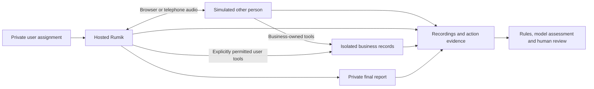

# Rumik benchmark: product and current architecture

**Historical implementation write-up.** For current benchmark results and recordings, use the [web-call](reports/webcall/README.md) and [telephony](reports/telephony/README.md) reports.

## 1. What we are trying to do

We are building a repeatable way to test whether **hosted Rumik can carry out a user's real-world request through a spoken conversation**. The benchmark gives Rumik an assignment, lets it speak to a simulated person, records what both participants actually do, and checks whether the user's request was completed correctly and within their permissions.

The target is Rumik acting as a personal assistant. For example, a user asks it to book a restaurant table. Rumik represents that user; the other participant represents the restaurant employee. OpenAI Realtime plays the employee. OpenAI is part of the testing apparatus, not a competing assistant being ranked against Rumik.

A good result must establish more than fluent speech. We want to know whether Rumik understood the request, kept the important constraints, handled unavailable options sensibly, obtained the right outcome, and accurately told the user what happened. We also want to know whether a failure came from Rumik, the simulated person, the audio connection, or the benchmark itself.

The broader intended setting includes Indian businesses and spoken Hinglish, with tasks such as booking, cancellation, negotiation and delivery coordination. These describe product direction. They do not mean all those workflows have been implemented or tested. Dataset design remains a separate workstream; the current saved live evidence covers one restaurant booking task.

### 1.1 The first concrete question

The implemented restaurant baseline asks: can Rumik secure the requested table, use an authorized fallback branch when necessary, and return an accurate reservation report?

The important distinction is between **a conversation that sounds successful** and **a task that is supported by evidence**. The restaurant saying “confirmed” is not enough. The benchmark checks the saved reservation and its action history. A correct reservation is also not enough if Rumik gives the user an incorrect reference or never delivers a final report.

### 1.2 What a trustworthy benchmark should deliver

| Output | Why it matters |
| --- | --- |
| A precisely versioned task and test setup | Another run must mean the same thing before results can be compared. |
| A real audio conversation | Speech recognition, overlap, interruptions and delivery can change the outcome. |
| Isolated business records | A booking must belong to exactly one attempt and cannot affect a real business. |
| Complete action evidence | Rejected, repeated and incorrect actions matter alongside successful actions. |
| Original recordings and event logs | Reviewers need to inspect what happened, not only a model's interpretation. |
| Separate validity and outcome decisions | A broken simulator must not become a Rumik failure or a false pass. |
| Versioned rule, model and human assessments | Disagreement and corrections must remain visible. |
| Explicit denominators | Five retries of one task are not five distinct capabilities. |

### 1.3 Snapshot and how to read this document

This document describes the local source and saved artifacts inspected on **20 September 2026**, at source revision `59ef1c8`. It was prepared by reading local files; no new provider call, transcription or paid evaluation was performed.

Some older documentation still says no live results exist or that private user-report delivery is unavailable. The local code and saved run evidence are newer: browser calls have been attempted, and a target-only report callback has been used. Those calls do **not** establish clean end-to-end qualification. See [current published results](reports/README.md) for the newer benchmark cohorts. The original local root report snapshot is preserved at `reports/archive/local-webcall-2026-09-21.md` (excluded from Git).

The architecture below distinguishes current implementation, observed historical behavior and work still needed. Current source must not be projected backward onto recordings made before a fix.

## 2. The simplest view of the system



The **harness** is the software surrounding Rumik that sets up, runs, records and evaluates the test. It does not replace Rumik's reasoning or give it the correct answer. It also does not secretly repair an incorrect booking to match the grading criteria.

There are six separate responsibilities:

1. The **target adapter** connects to hosted Rumik and records its configuration and call identity.
2. The **counterpart** plays the other person and reacts to the audio it receives.
3. The **transport** moves audio in both directions through a browser or telephone connection.
4. The **business environment** owns the fictional records and enforces business rules and permissions.
5. The **evidence layer** preserves recordings, events, tool actions and configuration.
6. The **evaluation layer** compares that evidence with the user's request and the frozen grading rules.

The controller coordinates these components. It handles budgets, lifecycle, cleanup and recovery rather than deciding what Rumik should say.

## 3. Product scope: implemented, demonstrated and still missing

| Capability | Current implementation | What the saved evidence establishes |
| --- | --- | --- |
| Hosted Rumik as the user's assistant | Implemented with separate user and counterpart briefs | A browser conversation referred to the supplied task and produced the expected booking. |
| Browser audio | Chromium, LiveKit and Web Audio bridge | Two-way speech was observed after startup and capture repairs. |
| Telephone audio | Plivo dialing, signed callbacks and media-stream adapter | No saved live telephone qualification in the inspected run cohort. |
| Restaurant reservation | Version-1 mock reservation workflow | One full conversation saved the expected reservation; overall grading remains inconclusive. |
| Private final report | Authenticated, target-only `submit_user_report` callback | One report was received; its reference identity was wrong. |
| Automatic stop after report | Current controller ends when the report arrives | Locally tested after the historical full call; no saved live rerun of that correction. |
| Hard restaurant scenarios | Version-2 workflow, negotiation, dietary terms and challenge events | Prepared cases and local tests; no saved live runs of these variants. |
| Reusable counterpart styles | Three optional profiles and bounded scenario policy | Definitions and preparation outputs; no live profile comparison established. |
| Rumik chooses and dials a destination | Outbound HTTP client primitive exists | No integrated outbound executor. Cases requesting it are rejected before dispatch. |
| A task spanning several calls or approvals | Not implemented | A retry, batch or long call is not evidence of multi-call behavior. |
| District, Uber or other external app actions | Not implemented | No claim of app-operation coverage. |
| Model grading | Saved-audio transcription and evidence-based OpenAI assessment | Two accepted assessments of the full conversation, plus three rejected responses. |
| Jev comparison | Optional TypeSafe shadow evaluation over saved text | No saved Jev evaluation in the inspected artifacts. |
| Human listening sign-off | Review export, validation and import paths exist | No imported human listening review found for the latest full conversation. |

The telephone adapter currently **dials into Rumik**. Both executable channels are labeled `harness_connected` and `single_call`. That label matters: it measures conversation behavior after the harness establishes the connection, not Rumik independently choosing whom to call.

## 4. The test definition and its information boundaries

### 4.1 A case is more than a prompt

An `ExecutionCase` is the complete, versioned definition of one test. Schema 2 separates the user's assignment from the simulated person's brief.

| Field or group | Responsibility |
| --- | --- |
| `case_id`, `version`, `schema_version` | Identify the task, revision and contract format. |
| `workflow`, `workflow_version` | Select the business implementation and its rules. |
| `user_task` | Rumik's private assignment, known facts, constraints and permissions. |
| `counterpart` | The other person's role, permitted facts and behavioral rules. |
| `target_tools`, `counterpart_tools` | Explicit grants for each participant; undeclared tools are denied. |
| `initial_state` | The isolated starting business records. |
| `criteria` | Private expected outcomes, required metrics and conversational rubrics. |
| `task_scope`, `call_initiation` | Declare single versus multi-call and harness-connected versus outbound execution. |
| `completion` | Select counterpart completion or final-report completion. |
| `conversation_events` | Optional authored opportunities such as a mistaken readback. |
| `counterpart_profile`, `scenario_policy` | Optional style and bounded behavior settings. |
| `evaluation_rubric` | Optional explicit definitions governing metric applicability and verdicts. |
| `harness_fixture` | Mark infrastructure-only exercises so they cannot count as benchmark coverage. |

Source: [execution contracts](/Users/bhaskarpandit/Documents/voice-agents-benchmarks/src/voice_bench/contracts.py) and [shared models](/Users/bhaskarpandit/Documents/voice-agents-benchmarks/src/voice_bench/models.py).

### 4.2 Who can see what

| Participant | Receives | Does not receive |
| --- | --- | --- |
| Rumik | User task, its authorized facts and tools, counterpart audio | Counterpart's hidden strategy, grading answers or unrestricted business state |
| Counterpart | Its own brief, received Rumik audio, its tool definitions and results | Private user assignment, hidden grading criteria or Rumik's transcript as a substitute for hearing |
| Business service | Trusted attempt and actor identity, operation and arguments | Authority to touch unrelated attempts or production business records |
| Evaluator and reviewer | Both briefs, criteria, sealed evidence and final state | Permission to repair the completed conversation or edit its raw evidence |

For example, a restaurant employee may know its minimum acceptable price. Rumik may know the user's maximum price. Neither gets the other's private limit from the harness. Either may learn something from what is actually said in the call.

Actor identity is supplied by the worker or authenticated endpoint. A model cannot gain restaurant permissions by placing `actor: counterpart` in its tool arguments.

### 4.3 Dataset instructions and speaking language

Cases may be authored in English while explicitly requiring spoken Hinglish. Dataset language and conversation language are separate settings. The benchmark does not replay a reference dialogue or feed Rumik an ideal sequence of replies.

Old sealed cases retain their original semantics. New execution does not silently accept the former customer-to-business role model. Internal names such as `caller/`, event source `caller` and `config/caller-effective.json` remain for compatibility; in schema 2 they refer to the simulated counterpart.

## 5. From a case to a live attempt

### 5.1 Plan without starting providers

The command-line interface loads cases and configuration, validates the supported scope, and creates a reproducible plan. A plan pairs cases, repetitions and channels, using a seed to randomize order. A `plan_id` identifies a planned item; a `run_id` identifies an actual attempt. A retry gets separate attempt state and evidence.

`status`, `plan` and `batch plan` are provider-free. Planning does not imply permission or sufficient funding to execute. Unsupported outbound and multi-call cases are rejected rather than simplified into an inbound conversation.

### 5.2 Compose the live runtime explicitly

`runtime.py` is the composition point used by explicit live commands. It validates positive funded limits, cost components, model and voice settings, the deployed target version, supported tools, callback connectivity settings and required credentials. Telephone execution additionally needs intended endpoints and an existing SIP trunk. SIP is the telephone signaling protocol used for that connection.

The live runtime starts the authenticated callback server, opens PostgreSQL, obtains a target snapshot, prepares the audio adapter, and gives the controller a counterpart and business service. Ordinary imports and standalone health routes do not initialize those provider clients.

Source: [live runtime](/Users/bhaskarpandit/Documents/voice-agents-benchmarks/src/voice_bench/runtime.py).

### 5.3 Freeze what defines the experiment

A batch snapshot records cases, runtime configuration, target deployment, tools, variables, dependency-lock hashes, source digest and random seed. The runtime checks target snapshot identity again before dispatching subsequent attempts. Detected drift stops further dispatch.

This protects comparisons from silently changing prompts or tools. The snapshot is still an observation at a point in time; it does not lock an external provider account. Account-wide tools can change independently. Resuming dispatch requires matching configuration, code and dependencies and reconciliation of unfinished attempts.

### 5.4 Execute one attempt

The controller proceeds through the following responsibilities:

1. Create fresh business state and persist the user's task, actor grants and expected target identity.
2. Claim a database lease so another worker does not own the same attempt.
3. Save the case and effective counterpart brief, then reserve funded limits before dispatch.
4. Persist dispatch intent before making the external connection request.
5. Connect the browser or telephone adapter and bind provider call identity to the run.
6. Wait for the authenticated before-call callback to serve Rumik's task. Check transport health while waiting.
7. Only after task delivery, start the OpenAI counterpart with its own brief and scoped tools.
8. Maintain independent audio send, audio receive and business-tool handling.
9. End on the case's configured completion signal or a bounded failure/timeout.
10. Close the media session, reconcile provider termination, seal business records, save final evidence and release capacity only when safe.

The setup deadline, conversation duration cap and finalization deadline serve different purposes. A provider's total call duration can include startup and shutdown and therefore exceed the configured conversation cap.

Source: [controller](/Users/bhaskarpandit/Documents/voice-agents-benchmarks/src/voice_bench/controller/runner.py).

### 5.5 Task delivery is authenticated and tied to a call

The before-call route accepts a call identity and agent identity, checks authentication, resolves the call to the right attempt, and verifies the target identity. Current code accepts the UUID and handle verified from the target snapshot. It does not accept an arbitrary agent alias.

The callback returns only the user's task. The receipt in `target/task-delivery.json` records identity and a task checksum. This proves that the harness served the assignment, not that the hosted target incorporated it correctly. Actual conversation behavior supplies additional evidence of task use.

Safe callback diagnostics record arrival, result status and validation stage. They exclude authorization headers, request bodies and private task text.

### 5.6 Final-report completion

For cases explicitly granting `submit_user_report`, Rumik can submit its own final answer through an authenticated private callback. The business service verifies call and agent identity, tool permission and attempt state. It retains request evidence and the target-authored receipt. The simulator does not receive this private report.

The current controller treats receipt of the report as completion, cancels the counterpart task, allows a bounded playback drain, and closes the session. The configuration name remains `target_report_then_hangup`, but the current code does not wait indefinitely for a second native hangup signal. A truthful failure report can end the attempt too; report presence does not imply successful task completion.

The latest saved full call predates this shutdown correction. It delivered a report but needed interruption. The report callback is an explicitly modeled benchmark output channel; it does not establish delivery through every native Rumik end-user interface.

Sources: [API routes](/Users/bhaskarpandit/Documents/voice-agents-benchmarks/src/voice_bench/api/app.py), [business service](/Users/bhaskarpandit/Documents/voice-agents-benchmarks/src/voice_bench/business/environment.py), [controller](/Users/bhaskarpandit/Documents/voice-agents-benchmarks/src/voice_bench/controller/runner.py).

## 6. How audio moves through the system

### 6.1 Browser path

The browser adapter registers the call with Rumik and binds its identity before redeeming the browser session. Chromium joins the assigned LiveKit room. LiveKit carries the real-time audio connection; Web Audio worklets handle small audio blocks inside the browser.

Counterpart-generated speech becomes the browser's virtual microphone. Remote Rumik audio becomes the counterpart's hearing. Independent queues allow simultaneous speaking and listening. Alternating text turns would not exercise the same behavior and could not prove interruption handling.

The browser bridge captures different stages separately:

- **Sent audio** is submitted to the transport. It can include speech later cancelled before playback.
- **Played audio** records the browser rendering boundary and is stronger evidence of delivery.
- **Received audio** records the target-side speech observed by the harness.

These are observation boundaries, not proof of an external person's subjective perception.

### 6.2 Startup and remote-track capture

Rumik may speak before the user-task callback completes. The current browser adapter retains that startup audio in a separate buffer bounded by the setup allowance, then supplies it in order when the counterpart starts. Increasing an ordinary five-second queue would not by itself solve callback delay or identify a failed transport.

Current browser code also attaches remote audio to a playing, zero-volume media element before Web Audio capture. Local WebRTC reproduction and the later live audio check supported this repair: the earlier capture had produced silence despite target speech.

Sources: [browser adapter](/Users/bhaskarpandit/Documents/voice-agents-benchmarks/src/voice_bench/channels/browser/adapter.py), [browser bridge](/Users/bhaskarpandit/Documents/voice-agents-benchmarks/browser/bridge.js), [audio worklet](/Users/bhaskarpandit/Documents/voice-agents-benchmarks/browser/audio-worklet.js).

### 6.3 OpenAI counterpart behavior

The counterpart runs over a server-side Realtime WebSocket, which keeps a persistent two-way connection open. Its perception comes from received audio. Its prompt contains its role brief, not hidden target transcripts or grading answers.

A separate tool worker prevents a database operation from stopping audio reception. Tool arguments execute only after the containing model response completes successfully. Cancelled or incomplete responses cannot mutate the business records.

When received target speech interrupts counterpart playback, queued speech is cleared and the model's conversation is truncated to the playback that was actually confirmed. This prevents the model from assuming that words it generated but never delivered were heard.

Source: [OpenAI counterpart](/Users/bhaskarpandit/Documents/voice-agents-benchmarks/src/voice_bench/caller/openai_realtime.py).

### 6.4 Telephone path

The phone adapter uses Plivo to dial the Rumik-connected endpoint. Signed HTTP callbacks describe call state, and an authenticated WebSocket carries audio. Unique route reservations help bind incoming provider identity to the intended attempt before business actions are permitted.

The path converts telephone audio using 8 kHz mu-law encoding and retains carrier playback checkpoints. A checkpoint received by the worker is not an exact remote playout timestamp. Telephone timing therefore has a different observation boundary from browser rendering.

This adapter is implemented and covered by protocol tests. It was not used by the five saved live attempts covered in the report. The outbound client primitive in the Rumik client is separate from this executable inbound path.

Sources: [phone adapter](/Users/bhaskarpandit/Documents/voice-agents-benchmarks/src/voice_bench/channels/phone/adapter.py), [media helpers](/Users/bhaskarpandit/Documents/voice-agents-benchmarks/src/voice_bench/channels/media.py), [target client](/Users/bhaskarpandit/Documents/voice-agents-benchmarks/src/voice_bench/target/rumik/client.py).

## 7. The business environment: observable actions without real-world side effects

### 7.1 Persistent state and actor permissions

PostgreSQL stores batches, runs, provider bindings, route reservations and callback identities. Each run owns its state and audit trail. Business mutations and their audit records commit in the same transaction, so a mutation cannot quietly succeed without its corresponding audit.

An operation is scoped by attempt and actor. Repeating the same valid request can replay its saved result without making a second booking; this is idempotency. Reusing an identity with conflicting arguments is rejected and retained. The target and counterpart cannot collide simply by choosing the same operation ID.

Tool permissions are denied unless explicitly granted. Rejected requests remain evidence. Once the attempt's business state is sealed, later requests cannot modify it. Rumik's tool requests resolve through authenticated provider identity; counterpart requests are bound to the run by the worker.

Sources: [PostgreSQL store](/Users/bhaskarpandit/Documents/voice-agents-benchmarks/src/voice_bench/storage.py), [business service](/Users/bhaskarpandit/Documents/voice-agents-benchmarks/src/voice_bench/business/environment.py).

### 7.2 Baseline reservation workflow

Version 1 gives the restaurant side two tools: `check_availability` and `record_reservation`. Inventory represents physical options, including unsuitable alternatives. The employee can query a branch and record the exact accepted option.

The service does not apply the user's private grading answer while booking. If the wrong available option is accepted, that wrong booking must remain visible. Otherwise the benchmark would be correcting the target's mistake rather than measuring it.

The saved booking contains the selected option, customer name, attempt-scoped reference, operation identity and consent evidence. Consent evidence links a completed readback, confirmed playback, target speech start/stop and the later booking. These structural links establish ordering. They do **not** establish that the words meant acceptance of all the correct terms.

Current reference delivery explicitly calls the identifier one reference, spells its characters including the hyphen, and asks for a complete readback. That improvement follows the latest run's split-reference error. It is not evidence that the historical report was correct or that the repair has passed a live retest.

Source: [reservation workflow](/Users/bhaskarpandit/Documents/voice-agents-benchmarks/src/voice_bench/business/reservations.py).

### 7.3 Hard-case workflow

Version 2 adds quotes, counteroffers, dietary requirements and explicit confirmation versions. Restaurant-owned tools are `check_availability`, `quote_reservation`, `counteroffer`, `set_dietary_requirements`, `prepare_confirmation` and `record_reservation`.

Changing a price or other term creates a new quote/confirmation identity and invalidates old confirmation state. Fresh accepted terms require fresh speech evidence. An answer to an unrelated birthday question cannot be treated as consent to a changed booking.

The three authored variants cover correction of time/seating, negotiation against a user cap, and dietary requirements excluding both onion and garlic. They are variants within the restaurant family. They do not demonstrate payment, delivery, cancellation, app use or multiple calls.

Sources: [dining workflow](/Users/bhaskarpandit/Documents/voice-agents-benchmarks/src/voice_bench/business/dining.py), [hard-case construction](/Users/bhaskarpandit/Documents/voice-agents-benchmarks/src/voice_bench/restaurant_hard_cases.py).

## 8. Scenario behavior and interruption opportunities

Optional profiles are `straightforward`, `concise` and `clarification_seeking`. They change the counterpart's speaking behavior without changing business facts, private user constraints, inventory or permissions. They are instructions whose compliance needs review, not guaranteed measured voice characteristics.

Conversation events can request a misread, clarification or distraction after successful tools and prerequisites. Replayed operations do not retrigger an event. A bounded scenario policy rejects competing pending events by default; explicitly authored priority ordering is also supported. An overflowing event queue is a simulator failure.

The evidence distinguishes an event requested from an event generated, played and reviewed. A challenge appearing in a prompt does not prove it was audible. A relevant Rumik correction overlapping an audible challenge, followed by appropriate stop and recovery, is stronger interruption evidence than overlap alone.

Missing challenge delivery leaves the capability untested. A delivered challenge without overlapping target speech is recorded as interruption not observed. Neither automatically fails the booking outcome. Human listening is necessary to establish the meaning and appropriateness of the exchange.

Sources: [scenario policies](/Users/bhaskarpandit/Documents/voice-agents-benchmarks/src/voice_bench/scenarios.py), [event observation](/Users/bhaskarpandit/Documents/voice-agents-benchmarks/src/voice_bench/evaluation/conversation_events.py), [design preparation](/Users/bhaskarpandit/Documents/voice-agents-benchmarks/src/voice_bench/design.py).

## 9. Evidence: preserve the original, then add interpretations

Each attempt has a local evidence directory under `artifacts/<batch_id>/<run_id>/`.

```text
manifest.json                 Artifact identities, sizes, hashes and missing items
config/                       Frozen case, runtime and effective counterpart setup
events.jsonl                  Ordered events with source, sequence and named clock
audio/                        Captured tracks at their documented boundaries
business/                     Initial/final state, requests and audit history
provider/                     Bindings, callbacks and available provider call evidence
target/                       Task-delivery and private final-report receipts
result.json                   Original execution result
evaluation/<version>/         Derived rules and model assessments
review/<version>/             Separate recovery or human review records
```

The manifest uses SHA-256 checksums, which are content fingerprints. Verification checks that every listed file still has its original bytes and size. **A matching checksum does not mean the evidence is complete.** A manifest may be internally intact and still explicitly list a missing provider record.

Raw evidence is sealed and preserved. Rescoring writes a new version instead of overwriting the old grade. Recovery records later provider knowledge separately. A file stored under `review/` with a recovery name is not automatically a human listening assessment.

Explicit S3-compatible uploads use checksums, stable keys and conditional writes to avoid replacing existing objects. There is no automatic upload merely because a run was inspected or a report was written. Credentials, datasets, transcripts, recordings and generated evidence remain outside Git.

Sources: [local evidence](/Users/bhaskarpandit/Documents/voice-agents-benchmarks/src/voice_bench/evidence/local.py), [object storage](/Users/bhaskarpandit/Documents/voice-agents-benchmarks/src/voice_bench/evidence/s3.py).

## 10. Evaluation: several kinds of proof, not one opaque score

### 10.1 Validity, attribution and outcome answer different questions

- **Validity:** was this a usable test of Rumik? Values are valid, invalid or unresolved.
- **Attribution:** where did the failure arise? Target, simulator, harness or unknown.
- **Outcome:** did Rumik satisfy the required task conditions? Passed, failed or unresolved.

A forbidden target action can fail the target. A forbidden counterpart action can invalidate the test. A valid target-side drop is still a failure; it must not disappear from the denominator. A harness cancellation is not proof that Rumik dropped the call.

### 10.2 Deterministic checks

Code checks compare final state with criteria, inspect action permissions, look for duplicate effects, verify required ordering and examine evidence availability. Restaurant checks inspect reservation count, history, reference allocation, consent anchors and report presence.

A correct final record does not erase an earlier incorrect committed booking. Conversely, the reservation service must not reject every wrong choice merely because the evaluator knows it is wrong.

Metric statuses are `met`, `not_met`, `uncertain` and `not_applicable`. Resolved results require evidence references. The scorer validates artifact hashes, referenced event sequences and audio ranges.

### 10.3 OpenAI model assessment

Model evaluation is separately enabled and funded. It reads sealed captured audio, transcribes bounded chunks, and sends the transcript with the user task, counterpart brief, business state/audit, report receipt and evidence gaps to the judge. The received track represents Rumik. Played audio is preferred for the counterpart; sent audio is a fallback with weaker delivery evidence.

Current transcription skips near-digital silence to reduce invented words. The judge must return exactly the requested metric names and select allowed evidence source IDs. The harness resolves those IDs to sealed artifact references. Invalid schema or citations are retained as failed evaluation attempts, not accepted grades.

The judge can evaluate a textual report mismatch. It cannot prove natural audio quality from text or infer exact interleaving from two independently transcribed tracks. Speech recognition may also omit or distort a word. A validated output means it passed the structural checks, not that every interpretation is correct.

Sources: [model judge](/Users/bhaskarpandit/Documents/voice-agents-benchmarks/src/voice_bench/evaluation/openai_judge.py), [scoring](/Users/bhaskarpandit/Documents/voice-agents-benchmarks/src/voice_bench/evaluation/scoring.py).

### 10.4 Human review

Reviewers use the original evidence to assess semantic consent, language quality, counterpart compliance and challenge delivery. Review imports require evidence and preserve disagreement with previous grading. Review can resolve interpretation but cannot rewrite what the system did.

For the latest saved full conversation, the two accepted model judges disagree about counterpart validity. Both leave consent and Hinglish quality uncertain. No human listening review was found to settle those issues.

### 10.5 Explicit rubrics and legacy grading

Prepared design cases can freeze `restaurant-status-v1`. Each metric declares applicability, method, required evidence, passing behavior and responsibility: requirement, validity, prerequisite or diagnostic. Required applicable metrics cannot be avoided by returning `not_applicable`.

Older cases without that optional rubric retain their existing grading behavior. The latest full baseline was such a case: it has required metrics and conversation rubrics, but not the new `evaluation_rubric`. Its model's `counterpart_validity: not_met` therefore must not be silently converted into a new saved overall validity decision. Preserve the saved unresolved verdict and explain the finding separately.

No agreed weighted composite score or universal latency threshold is implemented for this result set.

Sources: [rubric application](/Users/bhaskarpandit/Documents/voice-agents-benchmarks/src/voice_bench/evaluation/rubrics.py), [metric catalog](/Users/bhaskarpandit/Documents/voice-agents-benchmarks/src/voice_bench/evaluation/catalog.py).

### 10.6 Optional Jev shadow comparison

Jev is a TypeSafe text evaluator. The optional integration compares saved transcripts and selected structured evidence with other assessments. It does not listen to audio or transcribe it again. Raw recordings are not sent by this integration.

Its answers are shadow results: they do not replace benchmark grades. Explicit live evaluation is required to send evidence to TypeSafe. No such result was found in the current local run inventory.

Source: [Jev integration](/Users/bhaskarpandit/Documents/voice-agents-benchmarks/src/voice_bench/evaluation/jev.py).

## 11. Timing and audio-quality measurements

The main response gap is the end of delivered counterpart speech to the beginning of received Rumik speech. Browser measurements use mappings to a named audio-context sample clock. Carrier checkpoint receipt, provider timestamps and worker monotonic time are separate clocks and cannot be subtracted indiscriminately.

The offline detector uses 20-millisecond root-mean-square energy windows, a simple measurement of signal magnitude. It is reproducible but not a human-validated speech detector. Noise can look like speech, and quiet speech can be missed. Ordinary gaps, overlap and unanswered segments remain separate.

Counterpart turnaround is measured separately from observed voice-activity stop to first generated counterpart audio, on the same worker clock. It includes network and provider processing. It is not Rumik's internal time to first token.

No defensible response-gap percentile or interruption-quality score should be invented for the latest runs merely because recordings exist. Listening review and appropriate timing extraction are separate work.

Source: [timing implementation](/Users/bhaskarpandit/Documents/voice-agents-benchmarks/src/voice_bench/evaluation/timing.py).

## 12. Batches, budgets and recovery

### 12.1 Accounting

Reports retain planned items, attempted runs, connected attempts, valid/invalid/unresolved validity counts, passed/failed outcomes, unresolved outcomes and not-run plans. These are not all disjoint: connected is a subset of attempted, while not-run refers to planned items without dispatch.

The normal success rate is passed valid attempts divided by all valid attempts. With zero valid attempts, the rate is undefined, not zero percent. Repeated attempts on the same case do not increase independent task coverage.

Source: [batch reporting](/Users/bhaskarpandit/Documents/voice-agents-benchmarks/src/voice_bench/batches.py).

### 12.2 Spending and capacity

Before dispatch, the controller reserves an operator-supplied conservative cost ceiling and duration allowance. Components cover the counterpart, target and carrier where applicable. Model transcription/judgment has separate funding. The current dispatcher is serial; shared database reservations also enforce a concurrency ceiling among participating workers.

Reservations are not live billing. Their reliability depends on correctly estimated component ceilings and qualified provider limits. They do not account for unrelated external calls outside this database. Unknown cost or uncertain termination must not be treated as free usage.

Source: [budget reservations](/Users/bhaskarpandit/Documents/voice-agents-benchmarks/src/voice_bench/controller/budget.py).

### 12.3 Recovery and shutdown

Cleanup runs after normal completion, timeout and cancellation. Current code records a media-cleanup error and still attempts provider reconciliation within the finalization deadline. Capacity is released only with confirmed termination.

If a process exits after an uncertain dispatch, recovery inspects persisted identity and provider state. It may close an abandoned call when explicitly invoked with remote recovery. It never redials, resumes a lost conversation, guesses a missing call identity or chooses the next restaurant.

A batch can be `finalized_with_gaps`: the worker is stopped and accounting is saved, but the benchmark evidence or judgments remain incomplete. Operational closure and a valid benchmark pass are different facts.

## 13. Deployment and operator interfaces

The implementation is a Python package with a command-line interface, FastAPI callbacks, PostgreSQL persistence, and a small Node-built browser bundle. Python dependencies are locked with uv; browser dependencies are locked with npm. The documented development target is Python 3.12.

The command groups separate offline inspection/planning, local database fixtures, explicit live execution, saved-evidence evaluation, recovery, review and explicit upload. There is no management dashboard and no general HTTP call-start endpoint. The health API reports that the process is running; readiness remains 503 while qualification is incomplete.

The deployment direction is a fixed qualified India worker, with local evidence and optional immutable object storage. Container and Compose files exist. Earlier notes record an intermediate image build but an incomplete integrated container check after disk-space trouble. This document does not claim a fresh container build or a deployed India worker.

Sources: [CLI](/Users/bhaskarpandit/Documents/voice-agents-benchmarks/src/voice_bench/cli.py), [running guide](/Users/bhaskarpandit/Documents/voice-agents-benchmarks/docs/RUNNING.md), [infrastructure guide](/Users/bhaskarpandit/Documents/voice-agents-benchmarks/infra/README.md), [readiness](/Users/bhaskarpandit/Documents/voice-agents-benchmarks/src/voice_bench/readiness.py).

## 14. What still needs to be established

The following are remaining proof or product gaps, not changes performed while preparing this document:

1. **Clean browser qualification.** A separately authorized run must exercise the current report-completion and reference-readback behavior, terminate cleanly and save complete provider evidence.
2. **Listening review.** Semantic consent, counterpart readback compliance and natural intelligible Hinglish need evidence-backed review.
3. **Telephone qualification.** The phone path needs an equivalent authorized run with usable recordings and conservative timing interpretation.
4. **Hard-case qualification.** Negotiation, dietary terms and audible correction opportunities need live evidence before capability claims.
5. **Broader task orchestration.** Outbound choice/dialing, several-call tasks, approvals and app actions need additional execution components.
6. **Grader calibration.** Model disagreements and rejected answers motivate a human-reviewed calibration set before trusting aggregate model scores.
7. **Repeatable operating environment.** Current-source container validation and a qualified worker are still separate proof requirements.
8. **Coverage and statistics.** More task families and valid repetitions are required before general success or reliability estimates are meaningful.

## 15. Repository reading map

| Area | Main source | What to look for |
| --- | --- | --- |
| Input contracts | [contracts.py](/Users/bhaskarpandit/Documents/voice-agents-benchmarks/src/voice_bench/contracts.py) | Scope, roles, versions, completion and rubric consistency |
| Runtime | [runtime.py](/Users/bhaskarpandit/Documents/voice-agents-benchmarks/src/voice_bench/runtime.py) | Live gates, frozen settings, drift and dispatch |
| Attempt lifecycle | [runner.py](/Users/bhaskarpandit/Documents/voice-agents-benchmarks/src/voice_bench/controller/runner.py) | Task delivery, completion, cleanup and sealing |
| Audio counterpart | [openai_realtime.py](/Users/bhaskarpandit/Documents/voice-agents-benchmarks/src/voice_bench/caller/openai_realtime.py) | Audio perception, tools and interruption truncation |
| Browser connection | [adapter.py](/Users/bhaskarpandit/Documents/voice-agents-benchmarks/src/voice_bench/channels/browser/adapter.py) | Registration, startup buffering and capture |
| Phone connection | [adapter.py](/Users/bhaskarpandit/Documents/voice-agents-benchmarks/src/voice_bench/channels/phone/adapter.py) | Plivo calls, signed media and reconciliation |
| Business service | [environment.py](/Users/bhaskarpandit/Documents/voice-agents-benchmarks/src/voice_bench/business/environment.py) | Trusted actor identity, permissions and immutable completion |
| Workflow rules | [reservations.py](/Users/bhaskarpandit/Documents/voice-agents-benchmarks/src/voice_bench/business/reservations.py), [dining.py](/Users/bhaskarpandit/Documents/voice-agents-benchmarks/src/voice_bench/business/dining.py) | Inventory, confirmations, quotes and booking records |
| Evidence | [local.py](/Users/bhaskarpandit/Documents/voice-agents-benchmarks/src/voice_bench/evidence/local.py) | Append-only events, seals, checksums and derived versions |
| Grading | [scoring.py](/Users/bhaskarpandit/Documents/voice-agents-benchmarks/src/voice_bench/evaluation/scoring.py), [openai_judge.py](/Users/bhaskarpandit/Documents/voice-agents-benchmarks/src/voice_bench/evaluation/openai_judge.py) | Rules, evidence references, model constraints and review |
| Batch accounting | [batches.py](/Users/bhaskarpandit/Documents/voice-agents-benchmarks/src/voice_bench/batches.py) | Denominators, finalization, export and recovery |
| Current published results | [Benchmark reports](reports/README.md) | Web-call and telephony results with conversation evidence |
